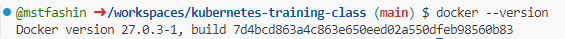
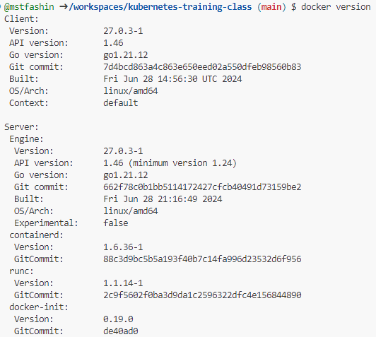

# Docker version check

Docker versiyonunu öğrenmek için terminalde veya komut satırında şu komutu kullanabiliriz.

```bash
docker --version
```



Bu komut, Docker Engine ve Client hakkında daha kapsamlı bilgiler verir. Örneğin:

```bash
docker version
```

