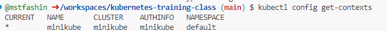
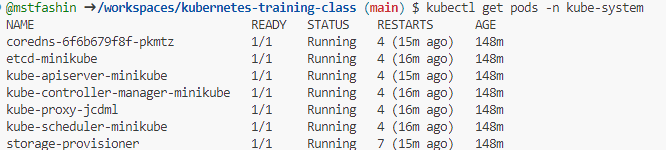
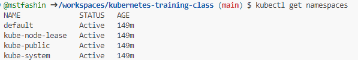

kubectl get pods -A

`kubectl` komutu, Kubernetes kümeleri üzerinde çeşitli işlemleri gerçekleştirmek için kullanılır. Pod'ları yönetmek ve listelemek için de sıkça kullanılır. İşte en sık kullanılan `kubectl` komutlarından bazıları ve örnekleri:

### 1. Tüm Pod'ları Listeleme
```bash
kubectl get pods
```
Bu komut, mevcut namespace içindeki tüm Pod'ları listeler.

### 2. Tüm Namespace'lerdeki Pod'ları Listeleme
```bash
kubectl get pods --all-namespaces
```
```bash
kubectl get pods -A
```
Bu komut, tüm namespace'lerdeki Pod'ları listeler.

### 3. Belirli Bir Namespace'teki Pod'ları Listeleme
```bash
kubectl get pods -n <namespace_adi>
```
Örnek:
```bash
kubectl get pods -n kube-system
```

### 4. Pod Detaylarını Görüntüleme
```bash
kubectl describe pod <pod_adi>
```
Bu komut, belirli bir Pod hakkında ayrıntılı bilgi verir.

### 5. Pod'un Detaylarını JSON Formatında Görüntüleme
```bash
kubectl get pod <pod_adi> -o json
```
Pod'un tüm ayrıntılarını JSON formatında görüntüler.

### 6. Pod’un Detaylarını YAML Formatında Görüntüleme
```bash
kubectl get pod <pod_adi> -o yaml
```
Bu komut, Pod'un ayrıntılarını YAML formatında görüntüler.

### 7. Pod'un Loglarını Görüntüleme
```bash
kubectl logs <pod_adi>
```
Pod'un loglarını gösterir. Çoklu konteyner içeren bir Pod için, konteyner adını belirtmek gerekebilir:
```bash
kubectl logs <pod_adi> -c <konteyner_adi>
```

### 8. Pod'ları İzleme (Watch Mode)
Pod'ların durumunu sürekli olarak izlemek için `-w` parametresi kullanılır:
```bash
kubectl get pods -w
```

### 9. Etiketlere Göre Pod'ları Listeleme
```bash
kubectl get pods -l <etiket_anahtari>=<etiket_degeri>
```
Örnek:
```bash
kubectl get pods -l app=myapp
```

### 10. Pod Silme
Belirli bir Pod'u silmek için:
```bash
kubectl delete pod <pod_adi>
```

### 11. Pod YAML’ını Export Etme
Pod'un manifestini dosya olarak dışa aktarmak için:
```bash
kubectl get pod <pod_adi> -o yaml --export > pod.yaml
```

Bu komutlar, Kubernetes üzerinde Pod'ları yönetmek için en çok kullanılan `kubectl` komutlarındandır.

kubectl config get-contexts



kubectl get pods -n kube-system



kubectl get namespaces




| **Command**                                  | **Description**                                                   |
|----------------------------------------------|-------------------------------------------------------------------|
| `kubectl get pods`                           | List all pods in the current namespace.                          |
| `kubectl get services`                       | List all services in the current namespace.                     |
| `kubectl get deployments`                    | List all deployments in the current namespace.                  |
| `kubectl describe pod <pod_name>`           | Display detailed information about a specific pod.               |
| `kubectl create -f <file.yaml>`             | Create a resource defined in a YAML or JSON file.               |
| `kubectl apply -f <file.yaml>`              | Apply changes to a resource defined in a YAML or JSON file.     |
| `kubectl delete pod <pod_name>`             | Delete a specific pod.                                          |
| `kubectl logs <pod_name>`                   | Fetch logs from a specific pod.                                 |
| `kubectl exec -it <pod_name> -- /bin/bash`  | Execute a command in a running pod (interactive shell).         |
| `kubectl scale deployment <deployment_name> --replicas=<number>` | Scale a deployment to a specified number of replicas.           |
| `kubectl port-forward <pod_name> <local_port>:<pod_port>` | Forward one or more local ports to a pod.                     |
| `kubectl get nodes`                          | List all nodes in the cluster.                                  |
| `kubectl get namespaces`                     | List all namespaces in the cluster.                             |
| `kubectl config view`                        | View the current configuration and context.                     |
| `kubectl top nodes`                          | Show metrics for nodes in the cluster (CPU/memory usage).      |

### Usage

To use these commands effectively, ensure you have `kubectl` installed and configured to communicate with your Kubernetes cluster. Always check the current context and namespace to avoid any confusion while managing your resources.