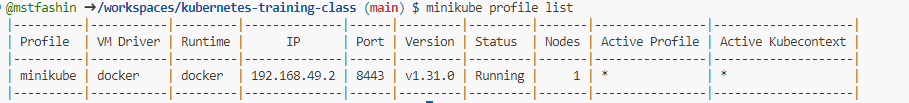
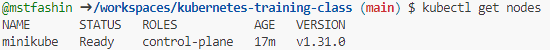
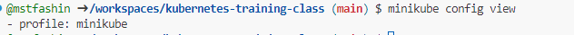

# Minikube Start


## Steps to Install Namespace

1. **Update and Upgrade the System**:
   Before proceeding, it's good practice to update the package lists and 
   upgrade installed packages:

   ```bash
   sudo apt update && sudo apt upgrade -y
   ```

2. **Start Minikube with Docker Driver**:
   
   To start Minikube using Docker as the driver, run the following command:

   ```bash
   minikube start --driver=docker
   ```

3. **Check Minikube Status**:

   Verify that Minikube is running correctly:

   ```bash
   minikube status
   ```

4. **Access the Minikube Dashboard (Optional)**:

   Minikube provides a dashboard for visual management. To launch it, run:

   ```bash
   minikube dashboard
   ```

5. **Using kubectl with Minikube**:

   You can now use `kubectl` to manage your Minikube cluster. For example, check the nodes in your cluster with:

   ```bash
   kubectl get nodes
   ```
6. **Minikube Profile**

   ```bash
   minikube profie
   ```

   Profillerin listesini almak için aşağıdaki komut çalıştırılır.

   ```bash
   minikube profie list
   ```
   

7. **Kubectl get nodes**

   ```bash
   kubectl get nodes
   ```

   

8. **minikube config view**

   ```bash
   minikube config view
   ```
   


minikube config set memory 4096

minikube config set cpus 2

minikube start --driver=docker

minikube config view